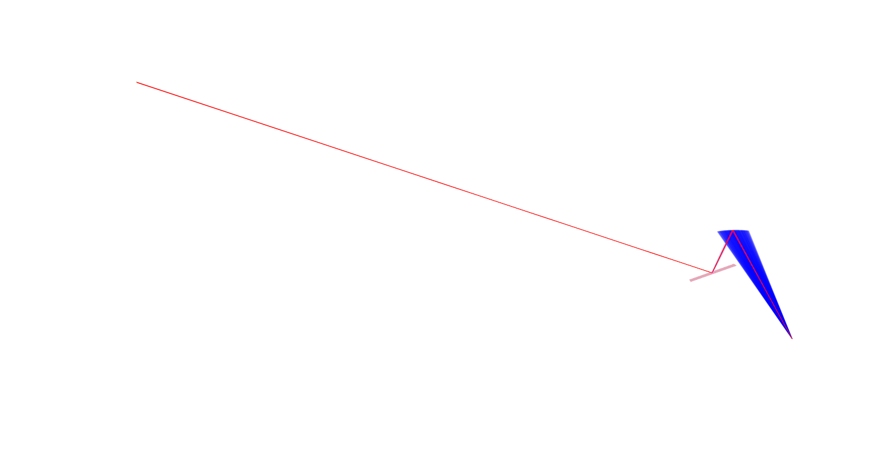

**Alpha angle of $0^o$, mag~20**

# Parameters
## Source
Number of iterations = 5
Intensity = 1e7
$\lambda$ = 1.5406
spread =  np.radians(6.0)

## Concave 4th order HOPG crystal
xy dimensions = 0.045 x 0.075
crystal d spacing = 0.8385
rocking_fwhm = 9.8054e-3

## Convex Si-422 crystal
xy dimensions = 0.015 x 0.045
crystal d spacing = 1.1085
rocking_fwhm = 13.404e-4

## Detector
xy dimensions = 0.02 x 0.02
Pixsize = 0.00005 (5e-5) --> change this value for [5e-6, 2e-5, 4e-5, 6e-5, 8e-5, 5e-4]

---
Pixsize = $5 \mu m$

---
Pixsize = $20 \mu m$

---
Pixsize = $40 \mu m$

---
Pixsize = $50 \mu m$

---
Pixsize = $60 \mu m$

---
Pixsize = $80 \mu m$

---
Pixsize = $500 \mu m$

## Observations
Similar to Concave Si-533 and Convex HOPG configuration.

