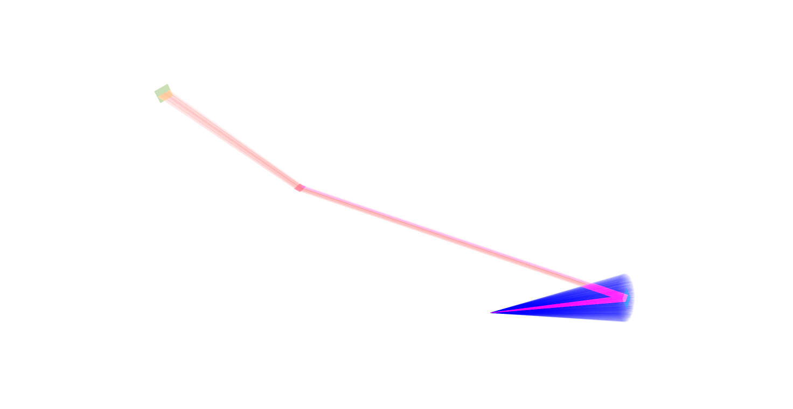

**For this configuration, I added a counterclockwise $\alpha$ angle of $80^o$ for a magnification of ~1.3**

# Parameters
## Source
Number of iterations = 5
Intensity = 1e7
$\lambda$ = 1.540601226300918 (from MATLAB code)
spread =  np.radians(6.0)

## Concave Si-533 crystal
xy dimensions = 0.02 x 0.02
crystal d spacing = 0.82817
rocking_fwhm = 10.196e-5

## Convex HOPG crystal
xy dimensions = 0.02 x 0.02
crystal d spacing = 3.354
rocking_fwhm = 48.620e-5

## Detector
xy dimensions = 0.04 x 0.04
Pixsize = 0.00005 (5e-5) --> change this value for [5e-6, 2e-5, 4e-5, 6e-5, 8e-5, 5e-4]

---
Pixsize = $5 \mu m$

---
Pixsize = $20 \mu m$

---
Pixsize = $40 \mu m$

---
Pixsize = $50 \mu m$

---
Pixsize = $60 \mu m$

---
Pixsize = $80 \mu m$

---
Pixsize = $500 \mu m$

## Observations
From what I understand, a smaller FWHM means a sharper spatial resolution. It can be seen that a detector pixel size of 0.0005 may be too large and a pixel size of 5e-6 may be too small. Staying around 5e-5, or $50 \mu m$ yields lower FWHMs. 

